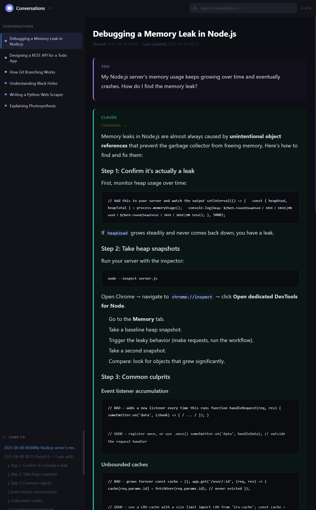

# Conversation Export Workbench — Quick Start

Convert **ChatGPT**, **Claude**, or **DeepSeek** conversation exports into HTML, Markdown, normalized JSON, and a searchable local conversation viewer.

## Source mode

Requirements: Python 3.11+; no runtime packages are required.

```bash
git clone https://github.com/ngallodev-software/conversation-export-workbench.git
cd conversation-export-workbench
```

### Convert an export

```bash
# ZIP exports are accepted directly when they contain conversations.json
python3 format_conversations.py --input ~/Downloads/export.zip --format html --yes

# JSON is accepted directly too
python3 format_conversations.py --input conversations.json --format md --yes
```

The provider is auto-detected for supported ChatGPT, Claude, and DeepSeek export structures.

### Guided mode

Put an export ZIP or `conversations.json` in the current directory and run:

```bash
python3 format_conversations.py
```

Interactive mode discovers local exports, asks what to process, and can build the viewer afterward.

### Useful commands

```bash
# List conversations
python3 format_conversations.py --input export.zip --list

# Export one conversation by ID
python3 format_conversations.py --input export.zip --id <conversation-id>

# Combine all conversations into one HTML file
python3 format_conversations.py --input export.zip --format html --combined --yes

# Override provider detection when necessary
python3 format_conversations.py --input conversations.json --provider deepseek --format md

# Build a portable offline bundle
python3 bundle_conversations.py --input export.zip --output my-chats.cew

# Include a directory of attachment payloads
python3 bundle_conversations.py --input export.zip --attachments-dir export-files --output my-chats-with-files.cew

# Merge CEW archives with duplicate resolution
python3 bundle_conversations.py --merge archive-a.cew archive-b.cew --output merged.cew
```

## Mobile / PWA

The mobile client can import `.cew`, raw provider ZIPs, or raw provider JSON directly. See [mobile/README.md](mobile/README.md) for Capacitor, Android/iOS signing, TestFlight, PWA, app-lock, and profiling instructions.

## Build the local viewer

```bash
python3 generate_spa.py --output output --yes
python3 serve_spa.py --output output
```

Open the URL printed by `serve_spa.py`.

The viewer supports provider filters, corpus-wide full-text search, sorting, jump navigation, timestamp controls, conversation visibility, scroll memory, lazy loading, and collapsible reasoning blocks. It has no runtime CDN dependency.



## Pre-built binary

No Python installation is required when using release binaries. Download the latest asset from:

https://github.com/ngallodev-software/conversation-export-workbench/releases/latest

Release assets are versioned as `conv-tool-vX.Y.Z-linux`, `conv-tool-vX.Y.Z-macos`, and `conv-tool-vX.Y.Z-windows.exe`.

The packaged executable uses subcommands:

```text
conv-tool format
conv-tool generate-spa
conv-tool serve
conv-tool bundle
```

See [BINARY_USAGE.md](BINARY_USAGE.md) for complete examples.

## Verify the repository

```bash
python -m pip install pytest==9.1.1
python -m pytest -q tests
./scripts/smoke_test.sh
```

## Privacy

Use synthetic data for development and bug reports. Real chat exports and generated `output/` content are ignored by the repository configuration, but you should still review staged files before committing.
