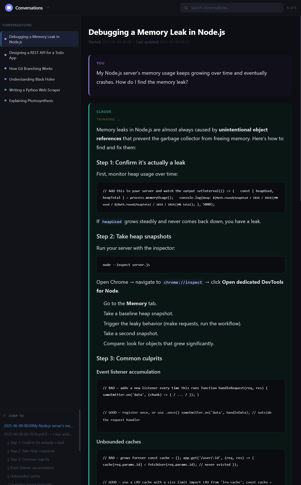
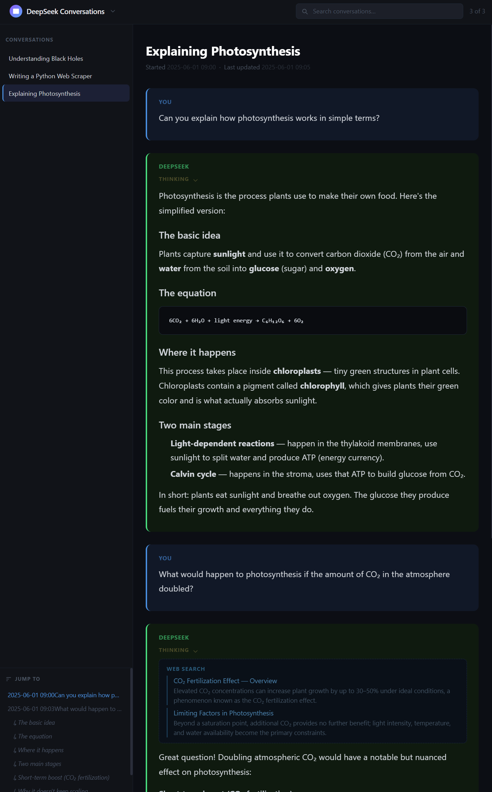
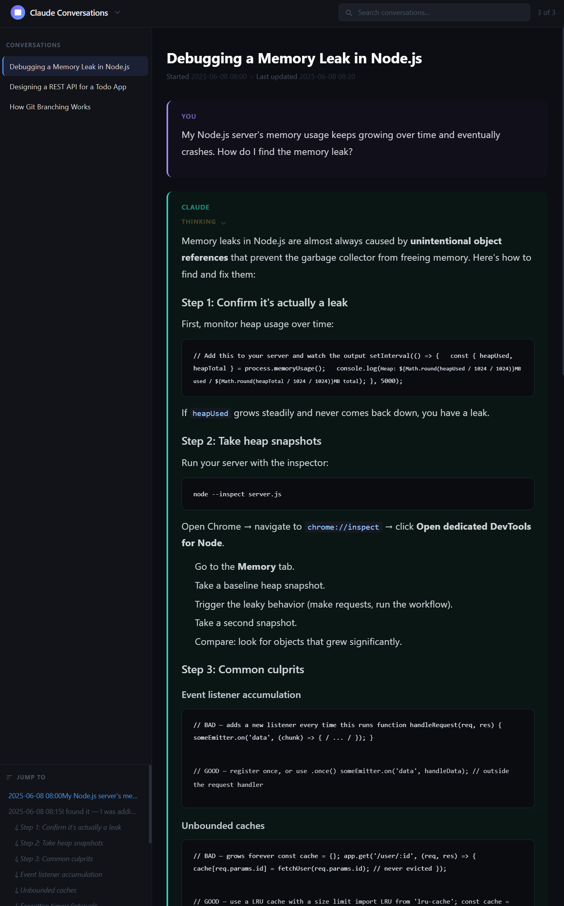
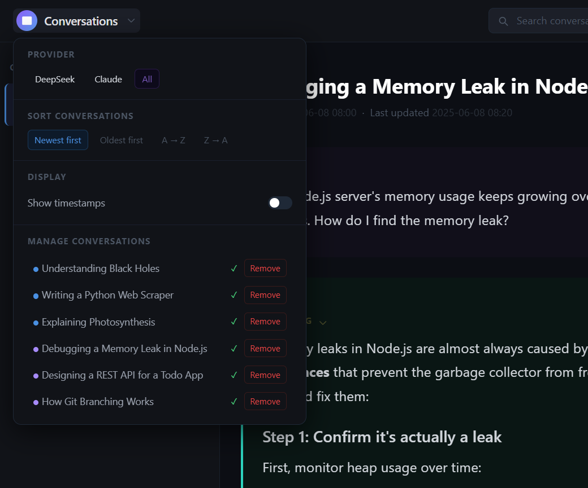

# Chat Export Viewer

A Python CLI with no Python package dependencies that converts **DeepSeek**, **Claude (Anthropic)**, and **ChatGPT (OpenAI)** conversation exports into styled HTML, Markdown, or cleaned JSON — with a built-in interactive single-page viewer.

> **Quick start:** see [QUICKSTART.md](QUICKSTART.md)



<p align="center">
  
  
</p>

---

## Features

- **Multi-provider support** — handles DeepSeek, Claude, and ChatGPT export formats out of the box
- **Template-based auto-detection** — identifies the provider from JSON templates; if no template matches, the tool asks for explicit provider confirmation
- **Three output formats** — styled dark-theme HTML, plain Markdown, and normalized JSON
- **Interactive SPA viewer** — browse all exported conversations in one page with search, filtering, sort, and per-message jump navigation
- **Thinking blocks** — DeepSeek `THINK` fragments and Claude extended thinking blocks rendered as collapsible sections
- **Web search results** — DeepSeek `SEARCH` fragments displayed inline with titles, URLs, and snippets
- **No Python package dependencies** — pure Python 3.10+ stdlib; nothing to install
- **Interactive mode** — run with no arguments to be guided through zip extraction, provider detection, and export step by step
- **Extensible** — drop a new template into `provider_templates/` to add support for additional providers

---

## Requirements

- Python **3.10 or newer** (uses `match`-free type hints; no third-party packages)

---

## Installation

```bash
git clone <repo-url>
cd conversation-export-workbench
```

No virtual environment or Python package installation needed.

---

## Getting your export file

### DeepSeek
1. Open [chat.deepseek.com](https://chat.deepseek.com) → Settings → **Export Data**
2. Download the `.zip` archive — it contains `conversations.json`

### Claude (Anthropic)
1. Go to [claude.ai](https://claude.ai) → Settings → **Account** → **Export Data**
2. Download the `.zip` — it contains `conversations.json` (and optional `projects.json`, `users.json`, etc.)

---

## Usage

### Interactive mode (recommended for first use)

```bash
python3 format_conversations.py
```

Scans the current directory for `.zip` archives and `conversations.json` files, prompts before each action, and optionally regenerates the SPA viewer at the end.

### CLI mode

```bash
python3 format_conversations.py [options]
```

#### Options

| Option | Default | Description |
|---|---|---|
| `--input FILE` | `conversations.json` | Path to input JSON |
| `--output DIR` | `output/<provider>/` | Where to write output files |
| `--provider NAME` | auto-detected | Force provider: `deepseek` \| `claude` \| `chatgpt` |
| `--format FORMAT` | `html` | Output format: `html` \| `md` \| `json` |
| `--id ID` | all | Export only the conversation with this ID |
| `--list` | — | Print all conversations with IDs and exit |
| `--combined` | — | Write all conversations to a single file (html/md) |
| `--yes` / `-y` | prompt | Overwrite existing files without prompting |

#### Common examples

```bash
# List available conversations
python3 format_conversations.py --list

# Export all as HTML (auto-detects provider)
python3 format_conversations.py --format html --yes

# Export a single conversation
python3 format_conversations.py --id <uuid>

# Export from a specific file to a specific directory
python3 format_conversations.py --input ~/Downloads/claude-export.json \
    --output ~/Documents/claude-html --format html --yes

# One combined HTML file for all conversations
python3 format_conversations.py --format html --combined --yes

# Force provider when auto-detection is ambiguous
python3 format_conversations.py --provider deepseek --format md
```

---

## Output formats

### HTML
Styled dark-theme pages — one file per conversation. Features:
- Thinking blocks as collapsible `<details>` elements
- Web search results rendered inline
- Per-message timestamps (toggleable)
- Clean code blocks with language labeling

### Markdown
Plain `.md` files suitable for editors, note-taking apps, or further processing. Thinking blocks are quoted, search results listed as links.

### JSON
Normalized, provider-agnostic JSON:
```json
{
  "id": "...",
  "title": "...",
  "started_at": "2025-06-01T09:00:00Z",
  "updated_at": "2025-06-01T09:05:00Z",
  "messages": [
    {
      "role": "user",
      "timestamp": "...",
      "parts": [{ "type": "text", "content": "..." }]
    },
    {
      "role": "assistant",
      "timestamp": "...",
      "parts": [
        { "type": "thinking", "content": "..." },
        { "type": "text", "content": "..." }
      ]
    }
  ]
}
```

---

## SPA viewer

Generate an interactive single-page viewer from your exported HTML files:

```bash
python3 generate_spa.py --output output/ --yes
```

Then serve it locally (the SPA uses `fetch()` so it requires a real HTTP server):

```bash
python3 serve_spa.py
# Open the printed URL (first free port from 8080 up to 80890, clamped at 65535)
```

Or with explicit settings:

```bash
python3 serve_spa.py --host 0.0.0.0 --start-port 8080 --end-port 80890
```

### SPA config and CSS templates

The SPA's appearance is controlled by CSS template files in `config/spa_output_templates/` and wired together via `config/spa.toml`:

```toml
[spa]
main_template   = "config/spa_output_templates/main_spa.css"
thread_template = "config/spa_output_templates/thread.css"

[providers.deepseek]
thread_template = "config/spa_output_templates/deepseek_thread.css"

[providers.claude]
thread_template = "config/spa_output_templates/claude_thread.css"

[providers.chatgpt]
thread_template = "config/spa_output_templates/chatgpt_thread.css"
```

To use a custom config:

```bash
python3 generate_spa.py --config path/to/custom.toml --output output/ --yes
```

### Viewer features

| Feature | Details |
|---|---|
| **Provider filter** | Settings menu lets you narrow to DeepSeek, Claude, ChatGPT, or All |
| **Live search** | Filters sidebar list and highlights matches inside the open conversation; full-text search across loaded conversations |
| **Sort** | Newest first, oldest first, A→Z, Z→A |
| **Jump navigation** | Sidebar panel lists every user turn and assistant heading; scrolls to it on click; active entry tracks scroll position via IntersectionObserver |
| **Timestamp toggle** | Show/hide per-message timestamps across the whole viewer |
| **Conversation visibility** | Hide individual conversations from the settings menu |
| **Scroll memory** | Returns to your scroll position when switching back to a conversation |
| **Lazy loading** | Conversations are fetched on demand and cached in memory |
| **Collapsible thinking** | `<thinking>` blocks converted to `<details>` on load |
| **Provider colour theming** | DeepSeek (blue/green), Claude (violet/teal), and ChatGPT (OpenAI green/warm sand) accents applied automatically |

**Settings menu** — provider filter, sort, timestamp toggle, conversation visibility



---

## Provider auto-detection

The tool loads detection templates from `provider_templates/` at startup. Each template is a JSON file named `<provider>.conversations-template.json` and contains a `_detection_signature` block:

```json
{
  "_detection_signature": {
    "root_type": "array",
    "item_must_contain": ["chat_messages", "uuid"],
    "item_must_not_contain": ["mapping"]
  }
}
```

Detection logic: the top-level JSON must be an array; the first item must contain all keys in `item_must_contain` and none in `item_must_not_contain`. The first matching template wins. If no template matches, the tool does not guess from formatter heuristics and asks you to choose `--provider` (or prompts interactively).

### Adding a custom provider

1. Create `provider_templates/myprovider.conversations-template.json` with a `_detection_signature` and `_template_meta.provider` set to your provider name.
2. Add a formatter module at `formatters/myprovider.py` implementing `PROVIDER`, `ID_FIELD`, `TITLE_FIELD`, `build_html_single()`, `conv_to_md()`, and `build_json_single()`.
3. Register the module in `_FORMATTERS` in `format_conversations.py`.

---

## Project structure

```
conversation-export-workbench/
├── format_conversations.py   # Main CLI entry point
├── generate_spa.py            # SPA builder CLI
├── formatters/
│   ├── __init__.py
│   ├── chatgpt.py             # ChatGPT formatter + active-branch tree walk
│   ├── claude.py              # Claude formatter
│   ├── deepseek.py            # DeepSeek formatter
│   ├── shared.py              # Shared utils: dates, slugify, markdown→HTML, HTML template
│   └── spa.py                 # SPA generator (CSS loader + metadata scanner)
├── config/
│   ├── spa.toml               # SPA config: which CSS templates to use per provider
│   └── spa_output_templates/
│       ├── main_spa.css       # SPA chrome: header, sidebar, menus, search
│       ├── thread.css         # Thread content area base styles
│       ├── deepseek_thread.css# DeepSeek accent colour overrides
│       ├── claude_thread.css  # Claude accent colour overrides
│       └── chatgpt_thread.css # ChatGPT accent colour overrides
├── provider_templates/
│   ├── chatgpt.conversations-template.json
│   ├── claude.conversations-template.json
│   └── deepseek.conversations-template.json
├── sample_data/
│   ├── claude-convo.json      # Sample Claude export (3 conversations)
│   ├── deepseek-convo.json    # Sample DeepSeek export (3 conversations)
│   └── sample_output/         # Pre-rendered HTML + SPA from sample data
│       ├── index.html
│       ├── claude/
│       └── deepseek/
├── output/                    # Your personal exports (git-ignored)
├── QUICKSTART.md
└── README.md
```

---

## Data model

### DeepSeek export (`conversations.json`)

```
[ conversation, ... ]
  conversation:
    id, title, inserted_at, updated_at
    mapping: { node_id → node }
      node: { id, parent, children[], message }
        message: { files[], model, inserted_at, fragments[] }
          fragment types:
            REQUEST   → { type, content }
            RESPONSE  → { type, content }
            THINK     → { type, content }
            SEARCH    → { type, results[{ url, title, snippet, cite_index }] }
            READ_LINK → { type, url }
```

The conversation tree is walked from `"root"` following the first child at each node.

### Claude export (`conversations.json`)

```
[ conversation, ... ]
  conversation:
    uuid, name, created_at, updated_at
    chat_messages: [ message, ... ]
      message:
        uuid, sender (human|assistant), created_at, updated_at
        content: [ block, ... ]
          block types:
            { type: "text",        text: "..." }
            { type: "thinking",    thinking: "..." }
            { type: "tool_use",    id, name, input }
            { type: "tool_result", tool_use_id, content }
```

---

## Privacy

| Path | Git status |
|---|---|
| `conversations.json` | Ignored |
| `*.zip` / `*data*.zip` | Ignored |
| `output/` | Ignored |
| `sample_data/` | **Tracked** (sample data only, no personal content) |
| `provider_templates/` | **Tracked** |
| `formatters/` | **Tracked** |

Never commit your own `conversations.json` or export zips. The `.gitignore` is configured to block them by default.

---

## License

MIT
