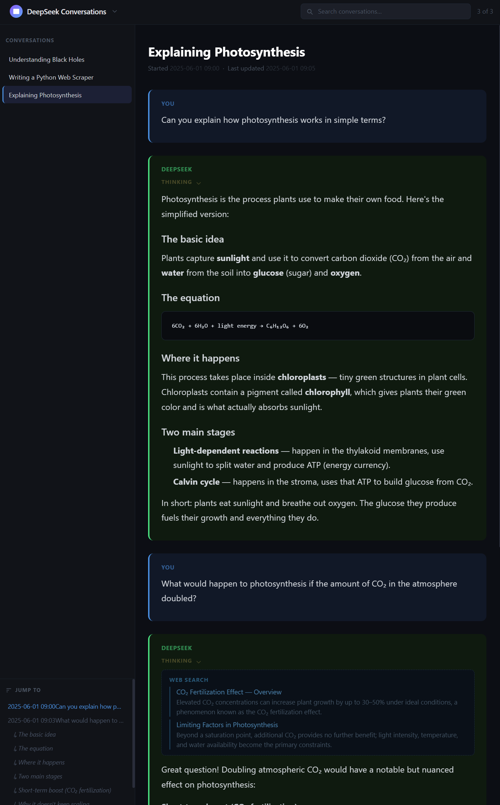
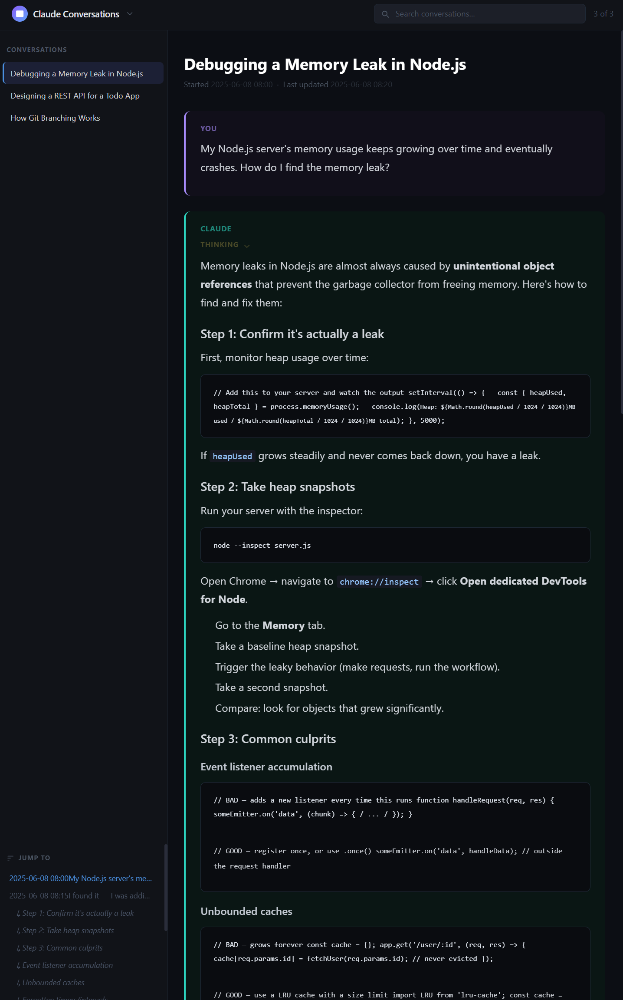
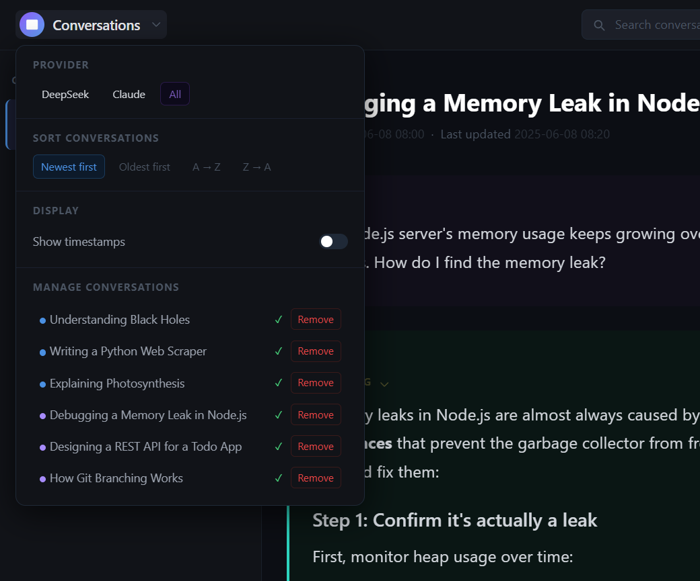

# Conversation Export Workbench

**Local-first ChatGPT, Claude, and DeepSeek conversation export viewer and converter.**

[](https://github.com/ngallodev-software/conversation-export-workbench/actions/workflows/tests.yml)
[](https://github.com/ngallodev-software/conversation-export-workbench/releases/latest)
[](#source-install)
[](LICENSE)

Conversation Export Workbench turns exported AI chat histories from **OpenAI ChatGPT**, **Anthropic Claude**, and **DeepSeek** into readable HTML, Markdown, or normalized JSON. It can also build a searchable local single-page workbench for browsing conversations across providers.

The runtime is Python-standard-library only. Conversion happens on your machine: the tool reads local export files and writes local output; it does not require a hosted backend or an API key.

> **Start here:** [Quick start](QUICKSTART.md) · [Pre-built binaries](BINARY_USAGE.md) · [Latest release](https://github.com/ngallodev-software/conversation-export-workbench/releases/latest)


<p align="center">
  
  
</p>

## What it supports

| Provider | Input | Auto-detect | HTML | Markdown | Normalized JSON |
|---|---|---:|---:|---:|---:|
| **ChatGPT / OpenAI** | official conversation export JSON or ZIP containing `conversations.json` | Yes | Yes | Yes | Yes |
| **Claude / Anthropic** | conversation export JSON or ZIP containing `conversations.json` | Yes | Yes | Yes | Yes |
| **DeepSeek** | conversation export JSON or ZIP containing `conversations.json` | Yes | Yes | Yes | Yes |

Provider detection is structural and template-based. If an export does not match a known provider signature, the CLI asks you to choose a provider instead of silently guessing.

## Why use it

- **One workbench for three AI chat providers** — browse ChatGPT, Claude, and DeepSeek histories with the same local tooling.
- **Local-first processing** — no account credentials, API keys, telemetry service, or remote conversion backend required.
- **Readable exports** — produce styled HTML, portable Markdown, or a provider-neutral JSON representation.
- **Searchable conversation viewer** — generate a single-page browser with provider filters, full-text search, sorting, jump navigation, and scroll memory.
- **Reasoning-aware rendering** — preserve DeepSeek THINK fragments and Claude thinking blocks as collapsible sections.
- **DeepSeek search rendering** — render SEARCH fragments with titles, URLs, and snippets.
- **Zero runtime package dependencies** — source mode uses Python 3.10+ standard library only.
- **Pre-built executables** — release binaries are published for Linux, macOS, and Windows with SHA-256 checksums.
- **Extensible provider model** — detection templates and provider-specific formatter modules are separated cleanly.

## Fastest path

### Option A: pre-built binary

Download the current release from the [Releases page](https://github.com/ngallodev-software/conversation-export-workbench/releases/latest). Asset names are versioned:

| Platform | Release asset pattern |
|---|---|
| Linux x86_64 | `conv-tool-vX.Y.Z-linux` |
| macOS | `conv-tool-vX.Y.Z-macos` |
| Windows | `conv-tool-vX.Y.Z-windows.exe` |

The binary has three subcommands:

```text
conv-tool format        # convert an export
conv-tool generate-spa  # build output/index.html
conv-tool serve         # serve the local viewer
```

See [BINARY_USAGE.md](BINARY_USAGE.md) for examples and checksum verification.

### Option B: source install

```bash
git clone https://github.com/ngallodev-software/conversation-export-workbench.git
cd conversation-export-workbench
python3 format_conversations.py --input /path/to/export.zip --format html --yes
python3 generate_spa.py --output output --yes
python3 serve_spa.py
```

**Requirements:** Python 3.10 or newer. No `pip install` is required for runtime use.

## Common source examples

```bash
# List conversations from an export
python3 format_conversations.py --input ~/Downloads/export.zip --list

# Convert everything to HTML
python3 format_conversations.py --input ~/Downloads/export.zip --format html --yes

# Convert to Markdown
python3 format_conversations.py --input ~/Downloads/export.zip --format md --yes

# Export one conversation by provider ID
python3 format_conversations.py --input conversations.json --id <conversation-id>

# Force a provider only when detection is ambiguous
python3 format_conversations.py --input conversations.json --provider claude --format html

# Combine all conversations into one HTML document
python3 format_conversations.py --input conversations.json --format html --combined --yes
```

Run `python3 format_conversations.py` with no arguments in a terminal for guided discovery of ZIP and JSON files in the current directory.

## Local conversation workbench

After generating HTML files:

```bash
python3 generate_spa.py --output output --yes
python3 serve_spa.py --output output
```

The generated viewer includes:

- provider filtering for ChatGPT, Claude, DeepSeek, or all conversations;
- full-text search and in-conversation highlighting;
- newest/oldest and alphabetical sorting;
- jump navigation across user turns and assistant headings;
- timestamp visibility controls;
- per-conversation visibility controls;
- scroll-position memory;
- lazy loading and in-memory caching;
- collapsible reasoning/thinking sections;
- provider-specific visual accents.



The viewer is intentionally served over local HTTP because its conversation pages are loaded with browser `fetch()`.

## Output model

### HTML

One styled HTML document per conversation, or a combined document. Provider-specific structures such as thinking blocks and DeepSeek search results are retained in readable form.

### Markdown

Portable text suitable for source control, note systems, search/indexing pipelines, or downstream processing.

### Normalized JSON

Provider-specific exports are converted into a common shape:

```json
{
  "id": "...",
  "title": "...",
  "started_at": "...",
  "updated_at": "...",
  "messages": [
    {
      "role": "user",
      "timestamp": "...",
      "parts": [
        { "type": "text", "content": "..." }
      ]
    }
  ]
}
```

This is useful when ChatGPT, Claude, and DeepSeek history need to feed the same downstream tooling.

## Provider detection and extension

Detection templates live in `provider_templates/`. Each describes structural keys that must or must not exist in a provider's conversation objects. Formatter code lives in `formatters/`.

To add another provider:

1. add a `provider_templates/<provider>.conversations-template.json` signature;
2. add a formatter module implementing the provider adapter functions;
3. register the formatter in `format_conversations.py`;
4. add sample data and regression coverage.

This keeps provider recognition separate from rendering and prevents heuristic guessing from being mixed into formatter logic.

## Project layout

```text
conversation-export-workbench/
├── format_conversations.py      # source CLI: detect + convert exports
├── generate_spa.py              # build the local multi-conversation viewer
├── serve_spa.py                 # local HTTP server for the viewer
├── cli_main.py                  # packaged binary entry point
├── formatters/                  # ChatGPT, Claude, DeepSeek + shared rendering
├── provider_templates/          # structural provider detection signatures
├── config/                      # SPA config and CSS templates
├── sample_data/                 # synthetic fixtures and generated samples
├── readme_assets/               # README screenshots
├── scripts/smoke_test.sh        # all-provider smoke test
└── tests/test_regressions.py    # regression suite
```

## Development and verification

Runtime code intentionally stays dependency-light. The test suite uses `pytest`.

```bash
python -m pip install pytest
python -m pytest -q tests/test_regressions.py
./scripts/smoke_test.sh
```

GitHub Actions runs the regression suite on pushes and pull requests. Tagged releases build Linux, macOS, and Windows executables and publish SHA-256 checksum files.

## Privacy and security

AI conversation exports can contain sensitive personal or business information. Keep real exports outside source control.

The repository ignores common local export paths and generated output:

| Path | Repository behavior |
|---|---|
| `conversations.json` | ignored |
| `*.zip` | ignored |
| `output/` | ignored |
| `sample_data/` | tracked synthetic/sample data |
| `provider_templates/` | tracked |
| `formatters/` | tracked |

The tool does not need your ChatGPT, Claude, or DeepSeek credentials. For security reporting, see [SECURITY.md](SECURITY.md).

## Contributing

Contributions are welcome for provider compatibility, rendering fidelity, viewer usability, tests, and documentation. See [CONTRIBUTING.md](CONTRIBUTING.md).

Please do not submit real conversation exports or other private chat data as fixtures.

## License

MIT — see [LICENSE](LICENSE).
